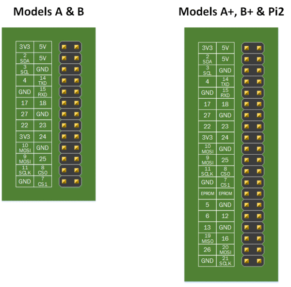

# Random Stuff

## Setup a Headless Rasberry Pi

**Step 1** - Flash RPi image with balena etcher.

**Step 2** - Mount boot partition (where .elfs reside) and 'touch ssh'

**Step 3** – Setting up the Raspberry Pi
Before we are going to install the Unifi Controller on the Raspberry Pi we first going to setup the Raspberry Pi self. You can copy paste the command in Putty. Just copy from this article and right click in Putty.

### Set a static IP Address
By default, the Pi is using DHCP to get an Ip address. This means that a reboot can cause it to get a new Ip address, which will make it hard to manage it with SSH or to open the Unifi Controller.

So we are going to set a static Ip Address on the network interface:

First, let’s check the current network details. Type: ``ifconfig``
In the result you will see eth0 and in that block inet: 192.168.x.x. This is the current ip address.
To edit the network config file type the following cmd:
``sudo nano /etc/dhcpcd.conf``
3. Enable to following lines by remove the # from it and set ip address to a fixed value

```
#Static IP configuration:
interface eth0
static ip_address=192.168.1.210/24
#static ip6_address=fd51:42f8:caae:d92e::ff/64
static routers=192.168.1.1
static domain_name_servers=192.168.1.1 1.1.1.1 fd51:42f8:caae:d92e::1
In this case, we set the IP address to 192.168.1.210 and the address of the internet router is 192.168.1.1. You also need to set the domain_name_servers, by default entering the router’s address is enough.
```
Which ip address should you pick? If you don’t know your network layout, keep the first 3 parts of the address the same and choose a value between the 200 and 240 at the end.

When done save and close the file by pressing ctrl + x and choose Y to save it.

Now we need to restart the network interface to apply the settings. Simply reboot the Pi with the cmd below. Wait a minute and connect to the PI with Putty on the new IP Address.

`sudo reboot`

### Change the default Password
Just with every (network)device you have, you should change the default password. 

<del>To change the password you will need to enter the current password first and then enter the new password twice:
Enter the cmd passwd:
pi@raspberrypi:~ $ passwd
Changing password for pi.
(current) UNIX password:raspberry
Enter new UNIX password:
Retype new UNIX password:
passwd: password updated successfully</del>

Use raspi-config to change password as it works better in headless mode. ``sudo raspi-config to change user password in headless ssh mode``

### Updating your Raspberry
Before we start installing software on the PI, we will make sure the Raspberry Pi is up-to-date. With the cmd below we will update the firmware, software and clean up unused and old software.

`sudo apt-get update && sudo apt-get upgrade -y && sudo apt-get autoremove && sudo apt-get autoclean`
This may take a minute or two. When done you will need to reboot the Pi. Sudo Reboot and reconnect your Putty a minute later.

### Install haveged
Not really necessary, but the startup of the Unifi Controller can take a bit long on a Raspberry Pi due to the fact there is no user interaction. Now you Pi should be running 24/7, so it’s not a big deal, but we can speed it up anyway.

Install haveged to solve the issue with the following cmd:

`sudo apt-get install haveged -y`
Update Java 8
This step is pretty important with the newer release of the Unifi Controller. Starting with version 5.10.x the old Java version that comes with Raspbian isn’t supported anymore. So we are going to replace it with OpenJDK 8.

`sudo apt-get install openjdk-8-jre-headless -y`

### Split memory
If you run the Raspberry Pi without a monitor connected you can safely reduce the amount of ram used by the GPU. By default, the Pi has assigned 64MB RAM to the GPU. Because we are using CLI (Command Line Interface) to work on the Pi, we can reduce that amount for RAM, leaving more RAM available for the Pi self.

Open the Raspberry Pi config with the following command:

`sudo raspi-config`
Select 7. Advanced Options
A3 Memory Split
Change 64 to 16MB
Hit Enter and use Esc to close the config screen.
Make sure you reboot the Pi to apply the changes.

# recipes

**Wild Flower Soda:**

1L jar full of flowers (unwashed but set out to de-bug)
1c white sugar (dissolved in warm water)
1 lemon, sliced
cold water to make up 1 gallon.

covered and left at room temp for 48h.  (stirred once to submerge stuff). Bottled when bubbles were readily apparent 

# reveal.js notes

change port value in /reveal.js/node_modules/grunt-contrib-watch/tasks/lib/livereload.js to avoid conflict with other projects using grunt:
```var defaults = {port: ~~35728~~35731};```

Run self-hosted presentation (with port control):
```npm start -- --port=8000```

# sonoff flashing
## ftdi spec 
**6Pin FTDI FT232RL USB To Serial Adapter Module USB TO TTL RS232 Arduino Cable**
The cables provide a fast, simple way to connect devices with a TTL level serial interface to USB
The cables are available with a 6-way SIL, 0.1" connector
TTL levels is 3.3V
The TTL-232R cables are a family of USB to TTL serial UART converter cables incorporating FTD's FT232RQ USB to Serial
UART interface IC device which handles all the USB signalling and protocols. The cables provide a fast, simple way to connect devices with a TTL level serial interface to USB
Each TTL-232R cable contains a small internal electronic circuit board, utilising the FT232R, which is encapsulated into the USB connector end of the cable
The other end of the cable comes with a selection of different connectors supporting various applications
Cables are FCC, CE, RoHS compliant and are available at TTL levels 3.3V
Cables are available with either a 6-way SIL, 0.1"pitch connector, a 3.5mm audio jack, an 8 way, keyed 2mmpitch connector (intended for use with VMUSIC2 or VDRIVE2) or bare, tinned wire ended connections
The USB side of the cable is USB powered and USB 2.0 full speed compatible
Each cable is 97cm(38.19") long and supports a data transfer rate up to 3 Mbaud
 
| Wire | Output |
| --- | --- |
|Red | 5V |
|Black | GND |
|White | RXD |
|Green | TXD |
|Yellow | RTS |
|Blue | CTS |

## raspberry pi model A
This old lady is a gen 1 kickstarter pi. she likes her job as an octopi 3D printing serve but can put out that sweet 3.3V I need.  To avoid uniting the pi and my CPU's ground I'll just do the flashing process with the Pi.  



### My Harness
Pin harness for Sonoff  

| Input | Wire | Sonoff Pin |
| --- | --- | --- |
| ftdi GND |Black | GND |
| ftdi RXD |Green | TX |
| ftdi TXD |White | RX |
| RPi Pin 1 |Orange | 3.3V |

## the sonoff firmware: ESPurna

## Hardware
### Sonoff RF R2 Power v1.0
https://github.com/xoseperez/espurna/wiki/Hardware-Itead-Sonoff-RF

note: to bypass RF microcontroller and boot in programming mode connect GPIO2 (labeled IO2) to GND for initial flashing then disconnect and OTA update. (re: https://www.youtube.com/watch?v=lLfIegdKPQg)

### Sonoff S20 Smart Plug
https://github.com/xoseperez/espurna/wiki/Hardware-Itead-S20


# Let's Encrypt Renew

## List of urls
greenhall.ca, www.greenhall.ca, biotekniq.ca, www.biotekniq.ca, ryuupastel.com, www.ryuupastel.com, thegreenclan.ca, www.thegreenclan.ca

## Script
creates folder in working directory
.
```Bash
#!/bin/bash

folder="cert-$(date +%F)"
mkdir $folder

#string manipulation ${string:start:length}
#echo "${1:0:43}"

for LINE in $(cat $1)
do
	echo $LINE > $PWD/$folder/${LINE:0:43}

done
```

# TM 087 Digital Timer

## link
[timer instructions](/rnd/media/TM087timer.pdf)

# ffmpeg one-liner images->video
```bash
ffmpeg -r 1 -pattern_type glob -i 'spin2019-10-02-15-26-56 (*.png' -c:v libx264 out.mp4
```