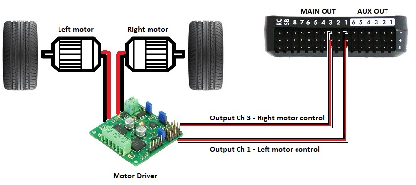

# System Integrations
Syntax:

Connection 1 | ID |-| ID | Connection 2
------------|-|-|-|------------
Pin 1 | |-| | Pin 1 
Pin 2 | |-| | Pin 2 
Pin 3 | |-| | Pin 3 

## Flight Controller to Companion Computer System
Reference:
Raspberry PI GPIO Pinout


### Wiring
FC_Telem2 (DF13) | ID |-|ID | CCS UART (GPIO)
------------|-|-|-|------------
Pin 1 | VCC |-| VCC | Pin 1 
Pin 2 | TX |-| RX | Pin 10
Pin 3 | RX |-| TX | Pin 8
Pin 4 | |-| | Pin 3
Pin 5 | |-| | Pin 3
Pin 6 | GND |-| GND | Pin 14 


### Code
#### FC
Param:
```
SERIAL2_BAUD: 115
SERIAL2_PROTOCOL: 1
LOG_BACKEND_TYPE: 3
```
#### CCS
localconf.json:
```json
"maverick_fc::mavlink_input": "/dev/ttyAMA0" //rpi serial interface
"maverick_fc::mavlink_baud": 115200 // max FC baudrate for Pixhawk
```

## Flight Controller to Motor Controller
Reference: 

### Wiring
FC OUTPUT | ID |-| ID | MC INPUT
------------|-|-|-|------------
Servo 1 | L Sig |-| MC L | Pin 2 
Servo 1 | L GND |-| MC L | Pin 3 
Relay 1 | L DIR |-| MC L | Pin 1 
Servo 3 | R SIG |-| MC R | Pin 2 
Servo 3 | R GND |-| MC R | Pin 3 
Relay 2 | R DIR |-| MC R | Pin 1

### Code
#### FC
Param:
```
PILOT_STEER_TYPE: 2 
MOT_PWM_TYPE: 3 // Brushed With Relay 
SERVO1_MAX: 2200 
SERVO1_MIN: 0 
SERVO1_TRIM: 0 // Important for centerloaded throttle 
SERVO3_MAX: 2200 
SERVO3_MIN: 0 
SERVO3_TRIM: 0 // Important for centerloaded throttle 
RELAY_PIN: 54 
RELAY_PIN2: 55 
```


